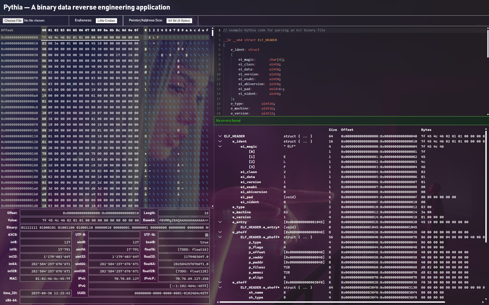

# Pythia

> [!CAUTION]
> This project is currently work in progress.
> It is not yet a finished product and therefore not ready for usage.

**Pythia** aims to be a light-weight, platform-agnostic analysis and reverse engineering tool for binary data.
(TODO : add description)




## Pythia coding language

In order to decode a given binary data blob, one has to provide the semantic structure of the binary data using a custom C-like programming language.


### Grammar

The language has the following grammar:

```bison
identifier          := /[a-z_]\w*/

// case-insensitive
number              := /-?[0-9]+/               // decimal numbers
                     | /-?0b[01]+/              // binary numbers
                     | /-?0x[0-9a-f]+/          // hexadecimal numbers

// case-insensitive
modifier_endianess  := '__LE' | '__LSB'         // little endian (least significant byte first)
                     | '__BE' | '__MSB'         // big endian (most significant byte first)

// case-insensitive
modifier_addr_size  := '__x8'                   // pointers and string/array lengths are 8 bit large (1 byte)
                     | '__x16'                  // pointers and string/array lengths are 16 bit large (2 bytes)
                     | '__x32' | '__x86'        // pointers and string/array lengths are 32 bit large (4 bytes)
                     | '__x64'                  // pointers and string/array lengths are 64 bit large (8 bytes)

fixed_size_constraint:= '<' number '>'          // sets the annotated field/struct/union to a fixed size of <n> bytes. This
                                                //  may be useful in clamping or padding scenarios, e.g.: "padding: void<6>;"

modifier_dont_parse := 'skip'

type_name_userdef   := identifier

type_name_builtin   := 'void'                   // 0 byte wide structure
                     | 'bool8' | 'bool'         // 8 bit wide boolean (1 byte)
                     | 'bool16'                 // 16 bit wide boolean (2 bytes)
                     | 'bool32'                 // 32 bit wide boolean (4 bytes)
                     | 'bool64'                 // 64 bit wide boolean (8 bytes)
                     | 'bool128'                // 128 bit wide boolean (16 bytes)
                     | 'int8'                   // 8 bit wide signed integer
                     | 'int16'                  // 16 bit wide signed integer
                     | 'int32'                  // 32 bit wide signed integer
                     | 'int64'                  // 64 bit wide signed integer
                     | 'int128'                 // 128 bit wide signed integer
                     | 'uint8' | 'byte'         // 8 bit wide unsigned integer
                     | 'uint16'                 // 16 bit wide unsigned integer
                     | 'uint32'                 // 32 bit wide unsigned integer
                     | 'uint64'                 // 64 bit wide unsigned integer
                     | 'uint128'                // 128 bit wide unsigned integer
                     | 'addr' | 'ptr'           // an unsigned integer with a size depending on the environment, i.e.:
                                                //  32 bit in an '__x32' environment, 64 bit in an '__x64' environment, etc.
                     | 'float8'                 // 8 bit wide IEEE754 floating point number
                     | 'float16'                // 16 bit wide IEEE754 floating point number
                     | 'float32'                // 32 bit wide IEEE754 floating point number
                     | 'float64'                // 64 bit wide IEEE754 floating point number
                     | 'float128'               // 128 bit wide IEEE754 floating point number
                     | 'uuid'                   // 128 bit wide UUID (RFC 9562)
                     | 'ipv4' | 'ip4'           // 32 bit wide IPv4 address
                     | 'ipv6' | 'ip6'           // 128 bit wide IPv6 address
                     | 'time32'                 // 32 bit wide unix epoch timestamp
                     | 'char8' | 'char'         // 8 bit wide ISO 8859 (extended ASCII) character (mostly compatible with CP-1252)
                     | 'char16' | 'wchar'       // 16 bit wide UTF-16 character
                     | 'char32'                 // 32 bit wide UTF-32 character
                     | 'uchar'                  // variable width UTF-8 character
                     | 'str' | 'cstr'           // zero-terminated ISO 8859 (extended ASCII) string
                     | 'wstr' | 'cwstr' | 'wcstr'// zero-terminated UTF-16 string
                     | 'ustr' | 'custr' | 'ucstr'// zero-terminated UTF-8 string
                     | 'lstr'                   // length-prefixed ISO 8859 (extended ASCII) string
                     | 'wlstr' | 'lwstr'        // length-prefixed UTF-16 string
                     | 'ulstr' | 'lustr'        // length-prefixed UTF-8 string

type_name           := type_name_userdef
                     | type_name_builtin

struct_type         := 'struct'
                     | 'union'

struct_definition   := [modifier_dont_parse] [modifier_endianess] [modifier_addr_size] struct_type type_name_userdef [fixed_size_constraint] struct_body ';'

struct_body         := '{' struct_member* '}'

struct_member       := [modifier_dont_parse] identifier ':' [modifier_endianess] [modifier_addr_size] type_identifier [fixed_size_constraint] ';'

type_identifier     := type_name
                     | struct_type struct_body
                     | type_identifier '[' array_size ']'
                     | type_identifier '*'

array_dimension     := <empty>
                     | number
                     | type_name_userdef

array_size          := array_dimension
                     | array_size ',' array_dimension

enum_member         := identifier ['=' number] ';'

enum_body           := '{' enum_member* '}'

enum_definition     := [modifier_endianess] [modifier_addr_size] ['flags'] 'enum' identifier ':' type_name enum_body ';'

type_definition     := struct_definition
                     | enum_definition

code_file           := type_definition*
```
